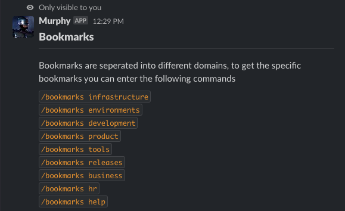
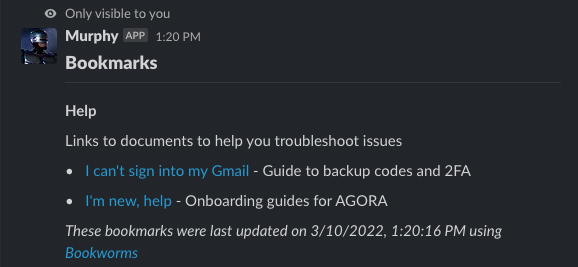
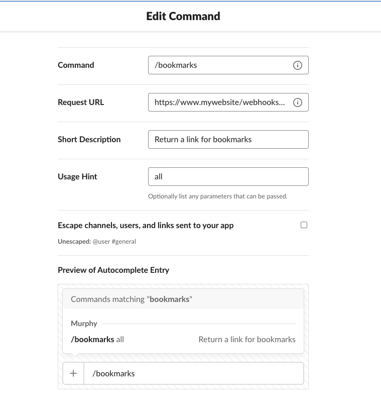

<p align="center">
  <a href="https://www.jamesbarryillustration.com/">
    
  </a>
</p>

> Make your bookmarks YMAL available in Slack

This module will add a `POST` request to your [Express](https://expressjs.com/) or [Fastify](https://www.fastify.io/) webserver that [Slack](https://api.slack.com/) can use as a webhook. It is a wrapper around [Bookworms](https://github.com/thearegee/bookworms) so it is recommended you understand how that works first.

This module is currently a prototype but is fully usable.

## How does it work?

- When a Slack [slash command](<(https://api.slack.com/interactivity/slash-commands)>) is called Slack sends a `POST` request a webhook URL
- Your webserver will get the generate a response based on the `POST` body and respond with a flavor of [markdown](https://github.com/jsarafajr/slackify-markdown#readme) designed for Slack
- Your Slack bot will respond privately to the user with their requested bookmarks

The following examples are based on an active Slack bot using Bookworms, how to do this and set up the command words are documented at the bottom.

### All commands

If the user didn't select a top level [Bookworms](https://github.com/thearegee/bookworms) folder or passed `all` the response will be a list of available commands.

```
/bookmarks all
```



### Specific bookmarks command

The commands from the `all` command is generated by the top level folders. You use the name of the top level folder and pass it to your slash command.

```
/bookmarks help
```



## Getting started

```BASH
$ npm i bookworms-slack-webhook
```

Once its added to your project you can import it into your webserver.

```JavaScript
import { expressWorms, fastWorms } from "bookworms-slack-webhook";
```

There is a different export for the two webservers but they have the same interface.

```JavaScript
await expressWorms(
  app,
  path,
  route
);

await fastWorms(
  app,
  path,
  route
);
```

- app - _Required_ the instance of your webserver
- path - _Required_ where the Bookworms bookmarks are coming from, this could be a local or remote `YAML` file. For more information see [Bookworms](https://github.com/thearegee/bookworms)
- route - the path on your webservers hostname Slack will use as a webhook. This parameter is optional with a default value of: `/webhooks/slack/bookworms`

### Parsing POST in Fastify

Currently because of an issue raised here: [https://github.com/fastify/help/issues/642](https://github.com/fastify/help/issues/642)

You need to ensure [`fastify-formbody`](https://github.com/fastify/fastify-formbody) is registered in your webserver.

See the Fastify example for more details.

### Examples

Below are simple examples of building a simple webserver with a webhook for Slack to use.

#### Express

```JavaScript
import express from "express";
import { expressWorms } from "bookworms-slack-webhook";
const app = express();
const port = 3000;

expressWorms(
  app,
  "https://raw.githubusercontent.com/thearegee/bookworms/main/demo/config/bookmarks.yaml"
);

app.get("/", (req, res) => {
  res.send("Hello World!");
});

app.listen(port, () => {
  console.log(`Example Express app listening on port ${port}`);
});
```

#### Fastify

```JavaScript
import Fastify from "fastify";
import fastifyForm from "fastify-formbody";
import { fastWorms } from "../../index.js";
const app = Fastify();
const port = 3000;

app.register(fastifyForm);

await fastWorms(
  app,
  "https://raw.githubusercontent.com/thearegee/bookworms/main/demo/config/bookmarks.yaml"
);

app.get("/", (request, reply) => {
  reply.send("Hello World!");
});

app.listen(port, () => {
  console.log(`Example Fastify app listening on port ${port}`);
});
```

## Integrated with Slack

You can add Bookworms to your already existing bot or read about [how to create a Slack bot](https://slack.com/intl/en-gb/help/articles/115005265703-Create-a-bot-for-your-workspace).

This webhook works on using [Slash commands](https://api.slack.com/interactivity/slash-commands).



- Command - The slpash command you want to use to trigger the webhook
- Request URL - The full URL for your service and your route path, this needs to be internet facing for Slack to call it
- Short Description - Help your users know what your the command does
- Usage Hint - A sample command for your users to know how to get started `all` will return all the top level folders

## Todo

- [Bookworms](https://github.com/thearegee/bookworms) was not designed to be included as part of a webserver so it uses console log and also exits process on an error. These are not ideal for web service so need to be fixed
- Test automation
- I dont really like there is a fastify and express export, want to clean that up a bit
- Would be nice to drill into deep folders
- There is currently a bug with double registering fastify form: https://github.com/fastify/help/issues/642

## Credits

The Bookworms logo was created by [James Barry Illustrations](https://www.jamesbarryillustration.com/).
